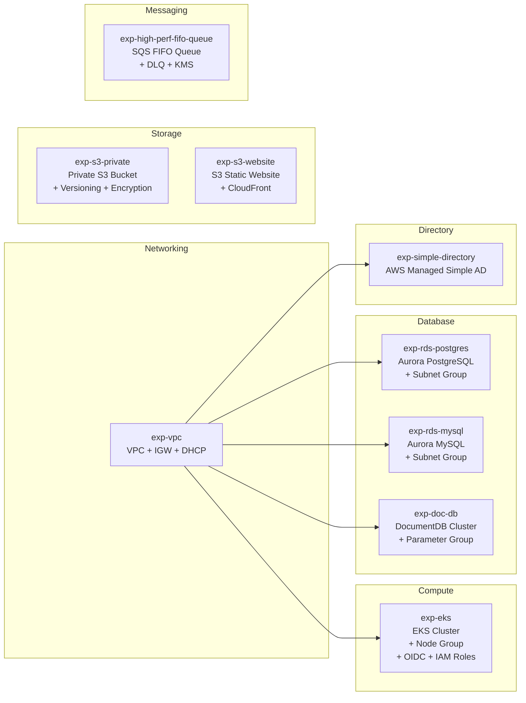

# Reusable Infrastructure Modules

A collection of reusable Terraform modules for common AWS services. Each module is independently consumable and designed to be composed into larger environment configurations.

## Architecture



## Available Modules

| Module | Description |
|--------|-------------|
| `exp-vpc` | VPC with Internet Gateway and DHCP options |
| `exp-eks` | EKS cluster with managed node group, OIDC provider, and IAM roles |
| `exp-rds-postgres` | Aurora PostgreSQL cluster with subnet group and parameter group |
| `exp-rds-mysql` | Aurora MySQL cluster with subnet group and parameter group |
| `exp-doc-db` | DocumentDB cluster with subnet group |
| `exp-s3-private` | Private S3 bucket with versioning, encryption, and bucket policy |
| `exp-s3-website` | S3 static website with CloudFront distribution |
| `exp-high-perf-fifo-queue` | High-throughput SQS FIFO queue with DLQ and KMS encryption |
| `exp-simple-directory` | AWS Managed Microsoft AD (Simple mode) |

## Usage

Reference a module from your Terraform configuration using the Git source:

```hcl
module "vpc" {
  source       = "git@github.com:hf-monteiro/infra-modules.git//exp-vpc?ref=tags/v1.0.0"
  env          = var.env
  vpc-cidr     = var.cidr
  vpc-name     = var.vpc-name
}

module "eks" {
  source       = "git@github.com:hf-monteiro/infra-modules.git//exp-eks?ref=tags/v1.0.0"
  cluster-name = var.cluster_name
  vpc-id       = module.vpc.vpc_id
  subnet-ids   = module.vpc.private_subnet_ids
}
```

After referencing a module or upgrading its version, reinitialize Terraform:

```shell
terraform init
terraform plan
terraform apply
```
